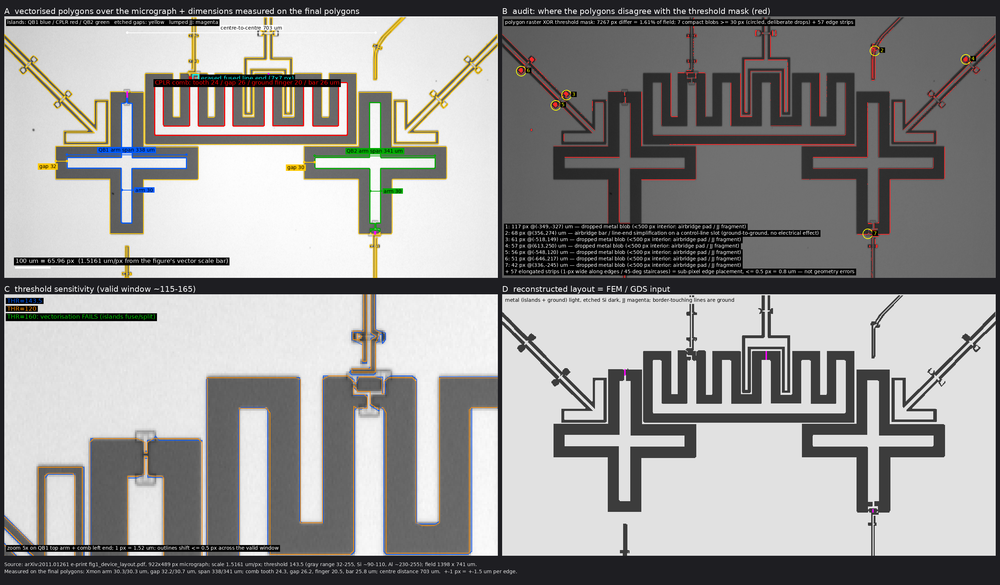

# 论文外部验证的完整账：Sung et al. PRX 11, 021058 → `sung_2021_device` 与 `sung_2021_xmon`

> 这份文档回答一个问题："本仓对论文的验证，到底验证了什么？"它围绕同一篇论文的**两块几何**展开：
> `sung_2021_device`——三个浮动双 pad 的**替代几何**，尺寸是 v3 时期用 ElmerFEM 一阶解标定到论文集总参数的，
> 契约 N15 那条"对论文 ±8%"测的就是它；`sung_2021_xmon`——直接从论文 Fig. 1(c) 显微照片量出来的**真拓扑**
> （接地 Xmon 十字 ×2 + 接地梳齿 coupler），不调任何参数。前者告诉我们管线是否忠实、以及"标定命中"是怎么回事；
> 后者告诉我们不调参时预测离真器件有多远、这个差距是几何还是求解器。两者放在一起，"±8%" 的含义与边界才说得清。
>
> 每个数字都能在仓库或论文原文里找到出处；读者不需要先读代码，需要代码细节时给出了文件位置。
> 数值出处：论文 PRX 版 Table I、Appendix B Fig. 7 图注、Appendix Q Table VI、Fig. 1(c)；本仓 `examples/sung_2021_*`、
> `docs/physics.md` §6/§12、`tests/test_live.py`；替代几何的原始 Palace CSV 在 `v4-dev` 分支 `.claude/n15-evidence/`；
> 真拓扑的原始 CSV / results / Elmer 输入在本分支 `.claude/xmon-evidence/`（`INDEX.md` 逐文件结论）；
> v3 时期的 Elmer 对照记录在 `v3` 分支 `.claude/session/2607280204.md`。

---

## 0. 先看结论

**替代几何 `sung_2021_device`（尺寸经标定）：**

| C_Σ（fF） | QB1 | CPLR | QB2 | 对论文拟合 E_C 换算值 |
|---|---|---|---|---|
| 论文，由拟合 E_C 换算 | 99.3 | 227.9 | 101.9 | — |
| 论文，由 Table VI 电容表自算 | 100.5 | 238.7 | 103.5 | +1.2% / +4.7% / +1.6% |
| v3 Elmer 档（qiskit-metal 重建，P1，6.87M 四面体） | 102.1 | 232.8 | 102.1 | 1.028 / 1.021 / 1.002 |
| v4，同一版图，**order 1**（14.1M 四面体） | 101.4 | 232.6 | 101.3 | 1.021 / 1.021 / 0.994 |
| v4，同一版图同一网格，**order 2**（契约配方 80/2） | **95.83** | **220.72** | **95.82** | **0.965 / 0.969 / 0.940** |
| v4，粗网格 160/10，order 2 | 101.2 | 231.0 | 101.1 | 1.019 / 1.014 / 0.992 |

**真拓扑 `sung_2021_xmon`（照片量出，零调参）：**

| C_Σ（fF），80/2 order 2 | QB1 | CPLR | QB2 | 对论文拟合 | β_1c / β_2c（论文 0.0364） |
|---|---|---|---|---|---|
| 描摹版（照片逐点矢量化，426 顶点，15.4M 四面体） | 87.78 | 160.57 | 91.20 | 0.884 / 0.705 / 0.895 | 0.0429 / 0.0414 |
| **参数化版（~20 个量得的参数，`build(solve=True)` 产品路径，12.8M 四面体）** | **86.74** | **159.83** | **88.97** | **0.874 / 0.701 / 0.873** | **0.0425 / 0.0409** |

五句话：

1. **同阶同答案。** 替代几何上，v4 的 order 1 与 v3 的 Elmer（也是一阶元）相差不到 1%；真拓扑上，Palace order 1 与
   Elmer 在**同一张网格**上整个 3×3 矩阵相对差 1.9×10⁻⁷。两套互不相干的求解器给同一个数——`.geo → 网格 → Palace → 约化`
   这条链没有翻译错误，后面所有差异都不来自管线。
2. **换阶露底。** 同一张网格只把 order 从 1 改成 2，C_Σ 掉 5.1～5.5%（order 1 比 order 2 高 5.4～5.8%）。一阶元系统性高估
   电容，是有限元的基本性质（§6），不是几何变了、也不是求解器坏了。
3. **旧吻合是抵消。** 替代几何的尺寸是 v3 时期**用 Elmer 一阶解当尺子**调到论文值的。尺子本身高 5～6%，调出来的几何就必然比
   论文低 5～6%；order 2 把尺子的偏差拿掉，几何的真实值（0.94～0.97）就露出来了。"Elmer 对论文 ±3%" 是"标定时吸收的偏差"与
   "一阶离散偏差"同幅反号、一加一减的产物，不是 Elmer 更准。
4. **真拓扑不调参就不命中。** 同一条管线、同一配方，喂给照片量出的真几何：Xmon 落论文 **−12～13%**，coupler **−30%**，
   β_qc **+12～17%**。这与替代几何的 −3～6% 之间差的就是"标定"这一步——N15 的 ±8% 衡量的是**标定收敛度**，不是对真器件的
   **预测精度**。
5. **差距是几何，不是求解器。** 真拓扑上 Elmer 同网格交叉到 10⁻⁷；测量误差预算（§4）最坏也只能解释 Xmon 那 12% 的一半、
   coupler 的 −30% 则完全解释不了。剩下的只能是几何：二维顶层照片里没有的结构（读出爪、空气桥、SQUID 环、封装环境）、
   零厚度金属、论文 Table VI 的 C_c 本身是集总模型总电容。

由此 N15 的判据定为：锚不动（论文值），C_Σ ±8%，β ±20%。8% 不是精度声明，是"未收敛网格 ~2% + 替代几何与真实器件的
结构差"的诚实预算（§7 ⑤）。真拓扑例子**不设判据**——它是预测，数字如实记录。

---

## 1. 论文做了什么

Sung, Ding, Braumüller 等（MIT EQuS / Lincoln Lab），*Realization of High-Fidelity CZ and ZZ-Free iSWAP Gates with a
Tunable Coupler*，Phys. Rev. X 11, 021058 (2021)，arXiv:2011.01261。

**主题是两比特门，不是版图。** 论文把可调耦合器（Yan et al. 2018 提出的"耦合器介导耦合与直接耦合相消"架构）推到色散近似
之外：门要做快，比特与耦合器就进入强杂化区（g/Δ ≈ 1/3），微扰框架失效；作者把耦合器当成一个需要工程化能级结构和精细控制的
多能级对象，用 Slepian 基最优控制压泄漏，用耦合器第二激发态 |020⟩ 的能级排斥被动抵消 iSWAP 的寄生 ZZ。结果：60 ns CZ 门保真度
99.76 ± 0.07%，30 ns ZZ-free iSWAP 99.87 ± 0.23%，都接近 T1 极限（摘要）。

**器件**（正文 §II、Fig. 1、Appendix B）：三个电容耦合的 transmon 一字排开，QB1 — CPLR — QB2。QB1 固定频率 4.16 GHz（单结）；
QB2（3.7–4.7 GHz）与耦合器 CPLR（3.7–6.7 GHz）用非对称 SQUID 磁通可调。每个单元有自己的 XY 驱动线和 λ/4 CPW 读出腔，QB2 与
CPLR 各有片上快速 Z 线。Fig. 1(c) 的显微照片显示两只比特是**十字形（Xmon 型）岛**、耦合器是一条**梳齿 / 弯折岛**，三者都是与周围
地平面隔一圈缝、由结接地的**接地 transmon**——Table VI 用"C_1、C_c、C_2 对地 + C_1c、C_2c、C_12 互耦"的三节点接地网络描述它，
与这个拓扑一致。论文正文与 arXiv 源码里**没有任何版图尺寸**（只给了结面积 1–3 µm × 200 nm）；版图只存在于那张照片里。

**论文给出的"真值"分三层，性质不同，读的时候要分开：**

| 来源 | 内容 | 性质 |
|---|---|---|
| Table I | ω/2π = 4.16 / 5.45 / 4.00 GHz（idle 点）；η/2π = −220 / −90 / −210 MHz；g_1c = 72.5、g_2c = 71.5、g_12 = 5.0 MHz（**脚注 c：在 ω_1 = ω_2 = ω_c = 4.16 GHz 处**）；T1/T2、读出腔参数 | **直接实测** |
| Fig. 7 图注 | 拟合电路参数：QB1 E_J/h = 12.2、E_C/h = 0.195 GHz；CPLR E_J1/h = 46、E_J2/h = 25、E_C/h = 0.085 GHz；QB2 E_J1/h = 13、E_J2/h = 2.8、E_C/h = 0.19 GHz | **对磁通谱拟合**得到，模型为 Koch 2007 的 transmon 哈密顿量 |
| Table VI | C_1 = 95、C_c = 228、C_2 = 98、C_1c = C_2c = 5.36、C_12 = 0.125 fF | **数值仿真的输入**（记号沿用 Yan 2018 附录 A），论文没说它来自实测还是设计仿真 |

静电求解能对上的只有第二、三层里的电容 / 电荷能。门保真度、相干时间、控制波形那一整套与本仓无关。

---

## 2. 两块几何

本仓的输入是两个文件：`.geo` 只管几何（OpenCASCADE，µm），每个面用四段 Physical 名 `role::layer::component::primitive` 绑定，
component 段 = **电学岛（net）**；`.meta.yaml` 管材料、计算域、网格、求解器、GDS 图层与电路模型。两块几何共用同一套 sidecar
口径：Si ε_r = 11.45、厚 750 µm；airbox 顶 890 / 底 1650 / 侧 200 µm（沿用 v3 实测的最佳精度档）；`outer_boundary: open`——
盒壁不挂边界条件（Palace 自然边界 ≡ 零电荷），电位参考由片上 `ground::1::chip::gnd` 提供；网格 max 80 / min 2 µm，导体边缘
Distance + Threshold 细化；`solver.order: 2`；结是集总元件——`jj::` 面进 GDS layer 20，但从静电网格里删除（当导体会把岛短路），
E_J 直接采用论文 Fig. 7 的拟合值，CPLR 与 QB2 的非对称 SQUID 没有磁通轴，取零磁通最大值 E_J1 + E_J2 = 71 与 15.8 GHz，
即模型永远坐在两只可调单元调谐范围的上沿。各 `.geo` / `.meta.yaml` 的头注是"论文报告值 / 几何出处 / 可断言与排除项"的**单一出处**。

### 2.1 替代几何 `sung_2021_device`：按论文集总参数标定

**拓扑：接地 Xmon → 浮动双 pad。** 论文器件是接地 transmon，而 `sung_2021_device.geo` 把三个单元都画成**浮动（差分）transmon**：
每个单元是上下两块矩形 pad，由结桥接，都不接地（`metal::1::QB1_t::pad` / `metal::1::QB1_b::pad`，CPLR、QB2 同理）。所以它
**不是论文版图的描摹，而是一个按论文集总参数标定的替代几何**：三对矩形 pad、一字排开、无十字臂、无梳齿。它复现的是 Table VI
那一层的电容网络参数，不是 Fig. 1(c) 那张照片。这个拓扑从 v3 第一版就是如此（v3 `.geo` 头注原文 "each a FLOATING (differential)
transmon = two identical pads"），v4 逐字继承，参数 diff 为零——双 pad 浮动 transmon 本身是标准版图（qiskit-metal 的默认部件
就长这样），单看渲染图挑不出错，只有对着照片才看得出拓扑不同，而论文 PDF 直到 2026-08-26 才进仓。

两块 pad 必须写成两个不同的 component：写成同一个会被并成一个 Terminal，等于把结短路——v3 曾这样写过，C_Σ 错 1.70× 且无任何
报错。器件归组放在 sidecar：`islands: [QB1_t, QB1_b]`。

**尺寸：用 Elmer 标定到论文的 C_Σ 与 C_1c。** 参数在 `.geo` 头部（µm）：

| 参数 | 值 | 作用 |
|---|---|---|
| `q_pad_w × q_pad_h` | 360 × 180 | qubit 单块 pad；两块间缝 `q_pad_sep` = 8 |
| `c_pad_w × c_pad_h` | 720 × 360 | coupler pad 线尺寸约 2×，目标 C_c ≈ 2.3 C_1 |
| `q_mx` / `q_my`，`c_mx` / `c_my` | 30 / 8 | pad 到地的左右缝 / 上下缝；`m_x` 是 C_Σ 微调旋钮 |
| `dx` | 30 | qubit pad 与 coupler pad 的间距，是 C_1c / C_2c 的旋钮 |
| ground sheet | 1900 × 1100 | 一整张地，挖三个互相重叠的 pocket |

三个 pocket 在 x 上重叠（重叠量 `q_mx + c_mx − dx` = 30 µm），qubit 与 coupler 的 pad 之间**不留地金属**——留了地，差分耦合
¼|c_tt + c_bb − c_tb − c_bt| 会坍缩（v3 实测差 20×）。这些尺寸是 2026-07-28 在 v3 分支上、以 qiskit-metal + ElmerFEM 一阶解为
测量手段，从一个 C_Σ 只有论文 1/4.5、耦合只有 1/20 的初版一路调到 102.1 / 232.8 / 102.1 fF（§5.1）。**这一点是 §7 论证的关键
前提**：几何本身就是拟合出来的。省掉的东西：读出腔、XY / Z 控制线、SQUID 环几何、结引线，以及论文器件的十字臂和梳齿。

### 2.2 真拓扑 `sung_2021_xmon`：从照片量出来

论文版图尺寸无处可查，唯一渠道是 Fig. 1(c)。arXiv e-print（`arxiv.org/e-print/2011.01261`）的 `fig1_device_layout.pdf` 内嵌的
就是那张 922×489 px 显微照片（与 PRX 版同一张，没有更高分辨率版本），但图上的 **100 µm 标尺是矢量**——15.83 pt，图像放置
4.1667 px/pt ⇒ **1.5161 µm/px**，视场 1398 × 741 µm。这块几何有两个版本，结果互为对照：

**描摹版 `sung_2021_xmon_traced.geo`**（`tools/micrograph_to_geo.py` 生成，不手改）：阈值二值化 → 连通域分类 → 轮廓 →
直角多边形 → OCC `.geo`。三个岛（QB1 / CPLR / QB2）、12 个地洞（三个 moat + 9 条被视场截断的控制 / 读出线槽）、426 个顶点，
每个多边形一段注释（是什么、多大、在哪）+ 一张坐标表 + `Call POLY`（qlib 新增的通用多边形宏）。视场内的控制 / 读出线并入地
（等价于在视场边缘接地）；空气桥当二维金属 / 缝；三个结的引线低于分辨率，按 2 µm 宽集总 `jj::` 条从岛端补到地。**唯一手工
干预**：抹掉一处被阈值粘到梳齿顶的线端（7×7 px）。方法与误差账见 §4。

**参数化版 `sung_2021_xmon.geo`**（发布的例子，72 行）：把描摹版按理想形状压成 ~20 个在描摹多边形上**精确读出的数**：
Xmon = 两条等长矩形臂的并（qlib 新增 `XMON` 宏：中心 (−352.5, −44.5) / (350.2, −44.3)，臂宽 30.3，端到端 339 / 342，
臂→地缝 32.2 / 30.7 µm），moat = 同形外扩缝宽；梳齿 coupler = 底梁（x −273.7…272.1，y 34.9…60.6）∪ 6 齿（宽 24.5，顶 185.0，
齿位 −261.5 / −163.0 / −64.1 / 48.5 / 160.7 / 259.3），moat = 同组矩形外扩 26.5——齿间地指（≈21 µm，量得 20.5）与 qubit moat、
coupler moat 之间那条 5 µm 地条都自然出现。省掉：视场内 5 条控制 / 读出线与贴着 Xmon 上臂的 L 形读出槽、空气桥、SQUID 框的 ∩ 带、
描摹版 1 px 级的不对称。**没有一个数是为了凑论文设的。** 两版的差在 §8 用 FEM 量出来：C_Σ 1～4%，β_qc 0.4%。

三个岛都接地，circuit_model 用单岛写法 `island: QB1`。这块几何没有测试断言——它是预测。

---

## 3. 论文真值怎么读，比较闭环的每一步

**第一步：把 E_C 换成 C_Σ。** 求解器输出电容，论文给的是电荷能。E_C = e²/(2C_Σ)，用 SI-2019 精确常数 e²/(2h) = 19.370 fF·GHz：
0.195 → 99.3 fF，0.085 → 227.9 fF，0.190 → 101.9 fF。这就是测试里 `paper = {QB1: 99.3, CPLR: 227.9, QB2: 101.9}` 的来历。

顺手做论文内部的一致性检查：Table VI 是三节点接地网络，节点总电容 C_Σ,1 = C_1 + C_1c + C_12 = 100.5 fF、
C_Σ,c = C_c + C_1c + C_2c = 238.7 fF、C_Σ,2 = 103.5 fF，换成 E_C 是 0.193 / 0.081 / 0.187 GHz，与拟合值相差 −1.1% / −4.5% / −1.5%。
**论文自己的两套数字对耦合器就差 4.5%**——这是任何容差讨论的地板：低于这个量级的"吻合"已经没有意义。

**第二步：用论文的 E_C、E_J 反算频率，确认抄对了。** f01 = √(8 E_C E_J) − E_C 给 4.17 / 6.86 / 4.71 GHz：QB1 对上实测 4.16，
CPLR 与 QB2 对上各自调谐范围的上沿 6.7 / 4.7。E_J 取零磁通最大值的口径是对的。

**第三步：β 的两种定义。** 无量纲耦合 β 是比 g 更适合对论文断言的量——纯几何比值，与磁通和 E_J 无关。论文侧
β_qc = C_1c/√(C_1·C_c) = 5.36/√(95 × 228) = 0.0364（q–q：0.125/√(95 × 98) = 0.0013）。本仓的定义是逆电容口径
β = |C′⁻¹_ij| / √(C′⁻¹_ii·C′⁻¹_jj)；在 Table VI 的三节点网络上按这个定义算得 0.0346。两种定义相差 O(C_1c/C) ≈ 5%，
在 ±20% 判据内，但比较时应知道有这层差异。

**第四步：我们的数字怎么来。** `build(meta, out, solve=True)`，两块几何走完全相同的路：

1. `build_mesh` 把金属面与 ground 面作为零厚度片 imprint 进衬底 / 真空界面，导体边缘细化（替代几何 14.1M 四面体，
   真拓扑参数化版 12.8M、描摹版 15.4M）；
2. `palace_config` 写 Palace 静电 config：`Model.L0 = 1e-6`（全仓唯一的 µm→m 换算点）、Terminal 顺序 = `mesh.labels`
   （替代几何 6 个：`CPLR_b, CPLR_t, QB1_b, QB1_t, QB2_b, QB2_t`；真拓扑 3 个：`CPLR, QB1, QB2`）、`Ground` 只挂 ground sheet、
   `Solver.Order = 2`；
3. Palace 逐 Terminal 加单位电位求解，输出 `postpro/terminal-C.csv`（**法拉**）；`parse_capacitance` ×1e15 得 Maxwell 矩阵
   （fF，+对角 −非对角），NaN/Inf 直接 raise；
4. `solve_circuit_model` 做约化：浮动单元引入差模 θ = φ_t − φ_b 与共模 σ，C′ = BᵀCB，**对完整 C′ 求逆再取 θθ 块**（只删共模
   行列再求逆是错的），C_Σ,k = 1/[C′⁻¹]_kk；接地单岛直接取 Maxwell 对角的逆矩阵元；然后 E_C = e²/2C_Σ、f01、α、β、g；
5. 落盘 `results.yaml` + `manifest.yaml`（输入 sha256），测试只读 `results.yaml`。

替代几何契约配方那次解的 Maxwell 矩阵（fF，归档件 `results_o2_contract.yaml`）：coupler 两块 pad 对角 335.1、pad–pad 互容 107.7；
qubit pad 对角 146.9、pad–pad 45.0；qubit pad 到近侧 coupler pad 16.6、到远侧 5.14；两只 qubit 之间 0.19。约化后
C_Σ = 95.83 / 220.72 / 95.82 fF，β_1c = β_2c = 0.0393，β_12 = 0.0016；从 Maxwell 直接算差分耦合电容 ¼|c_tt + c_bb − c_tb − c_bt| = 5.72 fF
（论文 5.36，+6.8%），差分 q–q 电容只有 0.0036 fF。真拓扑参数化版产品路径那次的 Maxwell（fF）：对角 160.38 / 86.90 / 89.12
（CPLR / QB1 / QB2），C_1c = 5.00、C_2c = 4.87、C_12 = 0.13——三节点接地网络，与 Table VI 的记号一一对应
（论文 95 / 228 / 98、5.36 / 5.36 / 0.125）。

**第五步：断言什么、排除什么。** `tests/test_live.py::test_sung_2021_against_paper`（闸 `QDSL_RUN_PALACE_SUNG=1`）只对替代几何：

- 三个 C_Σ 对 99.3 / 227.9 / 101.9，`rel = 0.08`；β_1c、β_2c 对 0.0364，`rel = 0.20`；
- **不断言 C_12 / β_12**：替代几何三对矩形 pad 的差分远场几乎完全相消，直接 q–q 电容 0.0036 fF 对论文 0.125 差 35×，Elmer 也只解出
  0.003。`results.yaml` 里 β_12 = 0.0016、g_12 = 3.6 MHz 与论文的 0.0013 / 5.0 MHz 接近**纯属巧合**——它来自 [C′⁻¹]₁₃，由 coupler
  中介的 C_1c·C_2c 路径主导，不是那条直接电容；
- **不断言绝对 g 与 CPLR / QB2 的 f01**：模型坐零磁通（f01 = 4.24 / 6.97 / 4.85 GHz），论文频率在 idle 点。g 的账可以算清：
  Table I 脚注 c 写明 g 是在 ω_1 = ω_2 = ω_c = 4.16 GHz 处报的；`results.yaml` 的 g_1c = 106.8 MHz 是 ½β√(f_1 f_c) 在 4.24 × 6.97 GHz
  处的值，折回 4.16 GHz 得 ½ × 0.0393 × 4.16 GHz = 81.7 MHz，对 72.5 是 +13%，与 β 的 +8% 同源——1.47× 的表面差异几乎全是频率因子。
  （`sung_2021_device.meta.yaml` 头注与 `physics.md` §12 把参考点写成"ω_c/2π = 5.45 GHz 工作点"，与脚注 c 不符，机制结论不受影响，
  措辞待订正，见 `plan.md`。）
- 真拓扑例子无断言：结果写在两份 meta 头注，原件归档，本文 §8 解读。

**第六步：证据。** 替代几何：2026-08-25 两次独立全管线（网格重划、Palace 重解）得到的 `terminal-C.csv` 逐位一致；契约档、同网格
order 1 交叉档、粗网格档三份原始 CSV 与 `results.yaml` 归档在 `v4-dev:.claude/n15-evidence/`。真拓扑：参数化版产品路径的
`terminal-C.csv / results.yaml / manifest.yaml / config`，描摹版契约级、两档粗网格、Elmer 交叉 sif+dat、阈值敏感档，共 7 组，归档在
`.claude/xmon-evidence/`（`INDEX.md`）。远端目录已删、机器已关，那里是唯一存续副本。

---

## 4. 照片测量方法与误差预算

*图：A 矢量化多边形叠回照片 + 在最终多边形上量得的尺寸；B 审计——多边形栅格化后与阈值掩膜逐像素 XOR（红），致密斑圈出并注明
性质；C 阈值敏感性 5× 放大（THR 120 / 143.5 / 160）；D 重建版图 = FEM / GDS 的输入。由 `tools/micrograph_to_geo.py` 与描摹版 `.geo`
一起生成，可复现。参数化版的 GDS 渲染见 `img/sung_2021_xmon_gds.png`。*

### 4.1 方法（逐步，含数字）

1. **源图与比例。** arXiv e-print 的 `fig1_device_layout.pdf` 内嵌 TIFF（922×489 px，CMYK）。标尺是**矢量**：`"100 μm"` 文字正上方
   一条 15.83 pt 的线；图像放置 221.28 × 117.36 pt → x、y 均 4.1667 px/pt（各向同性）。100 µm = 65.96 px ⇒ **1.5161 µm/px**。
2. **二值化。** 灰度直方图双峰：Si 87–110、Al 220–255；阈值取范围中点 143.5。浅 = 金属，深 = 裸 Si。
3. **分类。** 金属 8-连通分量：触图像边界 → 地（被视场截断的控制 / 读出线，等价于在视场边缘接地）；内部 ≥500 px → 岛（恰 3 个，
   按 x 命名 QB1 / CPLR / QB2）；<500 px → 缝（空气桥焊盘、结碎片）。缝 4-连通分量 ≥30 px → 地洞（12 个）。**唯一手工擦除**：
   (357,114) 处 7×7 px，一条线的末端被阈值粘到梳齿顶（连通性测试定位：唯一能让梳齿与地分离的点）。
4. **轮廓 → 多边形。** 0.5 等值面轮廓（落在像素边界）→ Douglas–Peucker 1 px → 边分类（|dy| ≤ 0.35|dx| 水平、反之竖直、其余保留
   45° 斜边）→ 顶点 = 相邻规范线交点 → 半像素格取整 → 去共线 → 折叠 <1 px 短边。
5. **坐标。** x = (px − 461)·1.5161，y = (244.5 − py)·1.5161；原点 = 照片中心，y 向上，单位 µm。
6. **核验。** 灰度剖面游程（整像素：臂 20、缝 21、臂展 224、齿 16–17 / 缝 18 / 地指 13 px）；多边形叠图（图 A）；栅格 XOR 审计（图 B）；
   GDS 渲染；Elmer 同网格交叉（§5.2，验管线不验几何）。

在**最终多边形**上量得（亚像素，shapely 直线求交）：Xmon 臂宽 30.3 / 30.3，臂端到地缝 32.2 / 30.7，臂端到端 338 / 341 µm；
梳齿 24.3、齿间缝 26.2、地指 20.5、底梁 25.8 µm；两 Xmon 中心距 703 µm。

**审计（图 B）**：多边形栅格与阈值掩膜差 7267 px = 视场 1.61%，其中 57 条是沿边 1 px 宽的条带或 45° 阶梯（边落在 ≤0.5 px 内的
取整，不是几何错误）；7 个致密斑中 6 个是有意删除的空气桥焊盘 / 结碎片（42–117 px），1 个是右上走线拐点处 2 px 宽空气桥横梁的
简化（地对地，无电学影响）。**没有漏画或错画的结构。**

一条实现注记：生成器最初把多边形发射成具名累加数组（`foo_p() += p`），而 gmsh 解析器变量是**进程级持久**的（`_gmsh.py` 记的坑），
`build()` 第二遍解析残留上一遍的点 tag → "Curve loop is not closed"；现在用 `POLY` 宏 + 整表 `=` 赋值。另一个新坑：`Call X;` 之后
同一行的语句会在宏体执行前被吃掉（对 `PAD` 也一样），取 `sret` 必须另起一行——已记进 `qlib.geo` 头注。

### 4.2 误差预算（最大可能误差）

| # | 误差源 | 性质 | 量级 | 对 C_Σ | 对 β | 依据 |
|---|---|---|---|---|---|---|
| A | 比例标定（作者事后画的矢量标尺，准到哪个像素无法验证） | 系统、全局 | 假定 ±1 px / 66 px ≈ **±1.5%**（未验证） | 同比例 ±1.5%（C ∝ 长度） | 0 | 无独立参照物 |
| B | 阈值 / 边缘定位 | 系统、逐边同向 | 过渡宽 ~1 px（剖面 221, 213, **154**, 90 只有一个中间像素）；有效窗口 115–165，窗口内边移 ≤0.5 px | **FEM 实测**（同粗网格 o1，THR 143.5→120）：**+2.5 / +4.0 / +6.1%** | **−2.9 / −5.8%** | 窗口外失效：<115 梳齿粘地成 0 岛，>165 结引线断裂把岛切成 4–6 块 |
| C | 照明梯度 | 系统、随位置 | 右半 Si 本底 100–107 vs 左半 87–90 | QB2 对阈值敏感度是 QB1 的 2.4×；QB1/QB2 的 3.9% 差可能部分是伪影 | 同 | 剖面直读 |
| D | 分辨率极限的细结构（5 µm 地条、6 µm CPW 缝、SQUID 框 ∩ 带 3–4 px） | 随机 + 系统 | ±1 px = ±25–50% | <1% | **估 ±5–10%**（地条是耦合的屏蔽件；未做 FEM 敏感性） | 剖面 |
| E | 矢量化简化（DP 1 px + 直角吸附 + 半像素取整） | 随机 | 面积 +0.29 / −0.70 / +1.11%，周长 −1.2～−2% | <1% | <1% | 多边形 vs 原始像素掩膜 |
| F | 解释性干预（擦桥、空气桥、结引线并入岛、边界线接地） | 离散 | 局部 10 µm 级 | C_c ~1–2%，其它 <0.5% | 小 | 结构尺度估算 |
| G | 像素各向异性 | — | 0 | 0 | 0 | PDF 放置矩阵 |

**合计**：最坏线性叠加 C_Σ(Xmon) ≈ ±6～9%，C_c ≈ ±8～10%，β ≈ ±11～16%；现实（RSS）C_Σ ±4～5%，C_c ±5～6%，β ±8～10%。
主导项是 B（阈值），其次 A（比例，不可验证）。

**与观测差距对照**：Xmon −12～13%、β +12～17%——阈值偏低（更多金属）的方向恰是 C_Σ↑、β↓，朝论文靠，半窗移动即可吃掉
2.5～6% 的 C_Σ 差与 3～6% 的 β 差，所以 Xmon 那 12% 里**测量误差可能占一半**。C_c −30%：任何合理阈值最多 +4～6%，比例最多
±1.5%，全部叠加到不了 10%——**这条不是测量误差**。不属于测量误差但主导最终差距的是模型不完整（§8）。

**参数化压缩的代价**（§8 表）：两版同网格同阶差 C_Σ 1～4%、β_qc 0.4%——与本节预算同量级，所以参数化版可以当例子。

要压误差（都没做，见 `plan.md`）：亚像素边缘拟合（对每条边取 50% 过渡点，B → ~1%）；局部自适应阈值（消 C）；比例只能问作者或找
GDS；对 D 做一次 FEM 敏感性。

---

## 5. 独立求解器：v3 的 Elmer 旁路与同网格交叉

### 5.1 v3 的 ElmerFEM 旁路是谁算的

时间是 2026-07-28（v3 分支 `.claude/session/2607280204.md`）。起因有两个：当时 v3 的 sung 例子在自己的挖空管线上根本划不出网格，
而用户要求对例子的几何做一次独立对照。于是走了一条完全绕开本仓几何管线的路：

1. 在本机从源码编译安装 **ElmerFEM 9.0**（`~/opt/elmer`，此前没装）；
2. 在 **qiskit-metal 0.7.6**（conda `quantum-metal`）里用 `designs.MultiPlanar` + 3 × `TransmonPocket` **按 `.geo` 的尺寸逐值重画**同一版图
   （pad / pocket / 缝宽照抄，bbox 逐个核对），layer stack 用 qiskit-metal 默认值：**2 µm 厚 PEC** 金属层 + 750 µm 硅；
3. 用 qiskit-metal 自带的 `QGmshRenderer` 划网格、`QElmerRenderer` 驱动 Elmer 的 `StatElecSolve`（一阶元）求解，外边界用
   `Electric Infinity BC`（远场）；
4. qiskit-metal 的 Elmer 后处理有两个上游 bug（相对路径假设；pandas ≥ 2 下链式赋值静默失效，Maxwell 对角被放错行列），所以
   **从 Elmer 原始 `cap_matrix.txt` 自行重建 Maxwell 矩阵**（Elmer 打的是 SPICE 互容且需 ×ε₀，已按源码核实）；
5. 最后用**本仓的** `circuit_model`（双岛差分声明）约化成 C_Σ、β。

所以对"Elmer 值是我们 build 的网格喂进 Elmer，还是第三方软件直接给的"这个问题，准确回答是：**两者都不是。** 几何是第三方工具里
重画的（尺寸相同），网格是第三方渲染器划的，求解器是第三方的；只有尺寸和最后一步约化代码与本仓相同。与 v4 契约路径的三处实质
差别：金属**有 2 µm 厚度** vs 零厚度片；远场 BC vs 自然 Neumann + 片上 ground；网格 min 2 / max 30 µm、6.87M 四面体 vs 80/2、
14.1M 四面体。共同点是**都是一阶元**。

这条旁路在 v3 里扮演了两个角色。一是**几何标定的尺子**：初版几何 C_Σ 只有论文的 1/4.5、耦合只有 1/20，就是靠 Elmer 一路调到
102.1 / 232.8 / 102.1 fF、C_1c = 6.01 fF（论文 5.36）、β = 0.0390。二是 v3 自己 Palace 的对照物：v3 整片 order 1（挖空路径，max 80，
1.54M 四面体）得 110.7 / 252.8 / 111.0，比 Elmer 高 8.4～8.7%，当时归因于网格更粗；v3 的整片 order 2 因多 rank 静默掉 rank
（issue #22）从未跑成；后来分块 order 2 对 Elmer −3%，v3 自己已经指出这是"分块 +12～15% 与 order 1→2 −21% 两个大误差反向抵消"。

还有两条当时就记下的事实，对 §7 很重要：Elmer 档自身**未收敛**——同几何 min 5 / max 50 网格比 min 2 / max 30 高约 6%；Elmer 换
ground 范围（A vs B 档）影响 <0.5%。整套脚本留在当时的 scratchpad，没进仓（issue #25）。

### 5.2 真拓扑上的同网格交叉（2026-08-27）

替代几何靠"Palace order 1 对 Elmer P1 <1%"证明管线正确，那是跨不同网格、不同金属表示、不同边界的对照。真拓扑上做得更干净：
把描摹版粗网格（160/10，276k 四面体）**原样**用 `ElmerGrid 14 2` 转成 Elmer 网格，写一份 `StatElecSolve` sif（一阶元，
`Calculate Capacitance Matrix`，`Coordinate Scaling 1e-6` 与 Palace 的 `L0` 同义），Terminal 与 Palace 完全相同；再与 Palace order 1
在**同一张网格**上比：

| C_Σ（fF），粗网格 P1 | QB1 | CPLR | QB2 | β_1c / β_2c |
|---|---|---|---|---|
| Palace order 1 | 108.45 | 204.62 | 113.36 | 0.0349 / 0.0339 |
| Elmer P1（同网格） | 108.45 | 204.62 | 113.36 | 0.0349 / 0.0339 |

整个 3×3 Maxwell 矩阵相对差 **1.9×10⁻⁷**（互容对到 7 位有效数字；对角的表观差纯是 Maxwell 约定 vs Elmer 的 SPICE 约定——Palace 对角 =
自容 + Σ互容，Elmer 对角 = 仅对地，换算后相同）。同网格隔离出的是纯"求解器对求解器"。**这钉死了一件事：真拓扑上 coupler 的低电容
不是 Palace 或网格的 bug**——换一个完全独立的求解器在同一几何上得同一个数，剩下的差只能是几何。顺带验证了 backlog #25
"Elmer 作第二后端"的可行路径：我们的 gmsh 网格可以直接喂 Elmer，不必经 qiskit-metal。sif 与 cap.dat 在 `.claude/xmon-evidence/`。

---

## 6. order 1 与 order 2 差在哪

Palace 的 `Solver.Order` 是有限元基函数的多项式阶。静电问题的未知量是电位 φ：order 1 在每个四面体上用线性函数、未知量在顶点；
order 2 用二次函数、未知量在顶点加边中点——同一张网格，未知量约多 7～8 倍（sung 的 14.1M 四面体在 order 2 是 18.5M 个 H1 未知量）。

**一阶元为什么系统性偏高。** Palace 对每个 Terminal 加单位电位求电位分布，电容矩阵由场能（∫ε E_i·E_j dV）得到。有限元是在一个
有限维子空间里做能量极小化，子空间比真实解空间小，得到的能量只可能大于或等于真值，所以**电容从上方收敛**；网格越细、阶越高，
值单调往下走。导体边缘的电场 ∝ r^(−1/2) 奇异，一阶元在那里最吃亏，而电容的误差恰恰集中在边缘。这也是为什么本仓坚持边缘细化
不能被升阶替代（光滑区升阶指数收敛，奇异点附近还得靠 h 加密）。

**实测**（全部同向）：

| 对照 | 变化 |
|---|---|
| two_pads，同网格 40/4，order 1 → 2 | 对角 25.769 → 24.722 fF（**−4.1%**），非对角 −2.119 → −1.976（**−6.7%**）；仓内常引的"order 1 偏 +7.3%"是对旧 golden 的最大元偏差 |
| 替代几何，同网格 80/2，order 1 → 2 | 101.4 / 232.6 / 101.3 → 95.83 / 220.72 / 95.82，**−5.5 / −5.1 / −5.4%** |
| 替代几何，order 2，网格 160/10 → 80/2 | 101.2 / 231.0 / 101.1 → 95.83 / 220.72 / 95.82，**−5.3 / −4.5 / −5.2%** |
| Elmer（一阶），min 5/max 50 → min 2/max 30 | 约 **−6%** |
| 真拓扑描摹版，同网格 160/10，order 1 → 2 | 108.45 / 204.62 / 113.36 → 92.0 / 169.3 / 95.6，**−15 / −17 / −16%**（梳齿与十字全是边缘，一阶元吃亏更多） |
| 真拓扑描摹版，order 2，网格 160/10 → 80/2 | 92.0 / 169.3 / 95.6 → 87.78 / 160.57 / 91.20，**−4.6 / −5.2 / −4.6%**（仍未收敛） |

CPLR 那条链最直观：P1 粗档 205 → P2 粗档 169 → P2 细档 160 fF，一路从上往下；连 P1 的过估（205）都已在论文 228 之下。Xmon 亦然
（P1 粗 108 / 113 = 论文 +9～11%，收敛到 P2 细 88 / 91 = −11～12%）——"P1 粗档接近论文"又是一次离散过估的巧合，与替代几何、
two_pads 同一回事。

代价：替代几何 order 2 在 96 核 / 384 G 机上 np = 32 单次 20 min（其中串行网格预处理 6 min、盘 IO 4 min），峰值内存 **154 G**
（64 核 / 128 G 机在多重网格层级组装处被 OOM 杀，无一字诊断）；同网格 order 1 只要 11 min。真拓扑描摹版 15.4M 四面体峰值 168 G，
参数化版 12.8M 四面体连本机划网格全程 46 min。误差估计器（RT 通量恢复）即使不做 AMR 也会跑，内存预算必须把它算进去。

顺带一个有用的观察：β 是逆电容元素的**比值**，离散偏差在分子分母上大部分抵消。替代几何的 β_qc 在 Palace order 2 是 0.0393、在 Elmer
一阶是 0.0390——对论文都是 +7～8%，这 7～8% 是几何（C_1c 5.72 / 6.01 对 5.36），不是离散。真拓扑上 β_qc 粗 o1 0.035 → 细 o2 0.042，
变化比 C_Σ 大，是因为这里 C_1c（5.0 fF）本身就是一个边缘主导的小量。

---

## 7. v4 改了什么，以及"误差相抵"的论证

**v4 与这件事相关的改动**：金属改为零厚度片 imprint（v3 是 2 µm 挖空，OCC 共面布尔在 sung 上必炸）；整片 order 2 能解了
（v3 #22 的"静默掉 rank"在干净构建的 Palace 上 np = 4 / 32 均正常，是环境问题）；浮动双岛约化补上"未认领岛禁止静默接地"的防线；
`Model.L0 = 1e-6` 成为唯一换算点；`build(solve=True)` 直接落 `results.yaml` + `manifest.yaml`；sung 升格为契约 N15 的 live 测试，
Palace 调用可透明转发到远端大内存机（`tools/palace_remote.sh`）。**替代几何一行没改**——v4 的 `.geo` 是 v3 标定好的那一份重写成
v4 命名约定。2026-08-26/27 新增：真拓扑例子（两版）、`qlib.geo` 的 `POLY` / `XMON` 宏、`tools/micrograph_to_geo.py`、`tools/gds_png.py`。

**论证。** 下面每一步都只用前面各节已经出现过的数字。

① **同阶、同尺寸、不同一切 → 同答案。** v4 order 1 对 Elmer 一阶：0.993 / 0.999 / 0.992。两条链的几何构建工具、金属表示
（零厚度 vs 2 µm）、边界写法（自然 Neumann + ground sheet vs 远场）、网格生成设置（14.1M vs 6.87M 四面体）全都不同，但**都是一阶元**。
差 <1%，其中还包含 two_pads 上实测过的板厚效应 ~0.8%。真拓扑上同网格交叉到 10⁻⁷（§5.2）。结论：v4 把几何翻译成网格和 Palace
config 是忠实的；剩下的一切差异不来自管线错误。

② **同网格、只换阶 → order 1 高出 5.4～5.8%。** 这一步除了阶什么都没动，所以这个幅度就是一阶离散误差本身的大小，与 two_pads 的
+4～7%、Elmer 自身粗细网格的 6% 属同一类、同一方向。

③ **尺子有偏，标定就把偏差吸进几何。** 替代几何的尺寸是在 Elmer 一阶解上调到 1.028 / 1.021 / 1.002 的（§2.1、§5.1）。既然一阶解比
收敛值高 5～6%（②），那么被调到"看起来等于论文"的几何，其收敛值必然比论文**低 5～6%**。用 order 2 一解，看到 0.965 / 0.969 / 0.940
——这不是新出现的误差，是标定时就埋进几何的偏差被显影出来。"Elmer 档对论文 ±3% 吻合"的等式两边分别是"几何偏低 5～6%"和
"一阶偏高 5～6%"，相加得零。**两个误差相抵**说的就是这个：标定偏差与离散偏差同幅反号。

④ **旁证。** 如果 Elmer 一阶真的更准，order 2 加密网格应该向 Elmer 值靠拢；实际上 order 2 从 160/10 到 80/2 是往下走 5%，且尚未
收敛，更细只会更低。Elmer 自己加密也是往下走 6%。两个求解器、两种阶、两组网格全部指向同一方向：真值在 95.8 以下，不在 102 附近。

⑤ **为什么锚不动、容差改成 ±8%。** 锚是论文值，因为它是唯一的外部真相。容差里的成分：契约配方尚未收敛（粗细两档跨 ~5%，方向已知）
与求解波动，记 ~2%；替代几何与真实器件的结构差——三对矩形 pad 对 Xmon 十字 + 梳齿并带读出爪、控制线、结引线，本就不是同一块金属；
版图左右对称使 QB1 = QB2 成为结构必然，而论文 99.3 与 101.9 不对称，两者不可能同时命中（QB2 的 −6.0% 因此是三条里最紧的）；
论文内部两套数字对 CPLR 也差 4.5%。±8% 是一个说得出账的预算，±5% 则是一个建立在抵消之上的错觉。β 的 ±20% 不动：order 2 实测 +8%，
两种 β 定义又差 5%，给 20% 是留给替代几何的。

⑥ **为什么不"调电容去凑论文"。** 回头改 pad 尺寸让 order 2 落到 99.3 / 227.9 / 101.9，就是用另一把尚未收敛的尺子（80/2 网格）再
标定一次——重复 v3 的错误，只是偏差从 +5% 换成 +2～3%。正确顺序是先做网格收敛扫（backlog #26），知道每个 C 值离收敛值多远，再谈把
期望值写进 meta 让 `build` 报偏差（#23）。而且论文自己的两套 C_Σ 就相差 4.5%，"凑到 1%" 没有目标可凑。

⑦ **真拓扑是对 ③ 的独立确证。** 同一条管线、同样的 80/2 order 2，喂给没调过参的照片几何，Xmon −12～13%、coupler −30%（§8）；
喂给被 Elmer 标定到论文的替代几何，−3～6%。两者之间差的就是"标定"这一步。所以 N15 的 ±8% 衡量的是标定收敛度，不是对真器件的预测
精度——两块几何角色互补：`sung_2021_device` 做管线自参照回归（拟合），`sung_2021_xmon` 标出真实预测边界（预测）。这也是 todo
"adjust capacitance to match" 的两种落法：v3 已经用 Elmer 把替代几何调到命中；真拓扑则明确不调。

关于措辞：`docs/physics.md` §12 把替代几何 −4～6% 的缺口归因于"简化版图结构性缺失"。本文的读法是：缺口的**大小和符号首先由标定机制
决定**（③），版图缺失与拓扑差异解释的是"为什么替代几何不该被期待精确命中、为什么不该回头调几何"（⑤⑥）。两种说法不矛盾，但因果
主次以本文为准。

---

## 8. 真拓扑的数字与解读

**全部结果**（无调参；`C_Σ` 单位 fF；论文拟合 99.3 / 227.9 / 101.9）：

| 几何 / 配方 | QB1 | CPLR | QB2 | 对论文 | β_1c / β_2c | 来源 |
|---|---|---|---|---|---|---|
| 描摹版，160/10 order 1 | 108.45 | 204.62 | 113.36 | 1.092 / 0.898 / 1.112 | 0.0349 / 0.0339 | 本机 Palace；Elmer 同网格逐位相同 |
| 描摹版，160/10 order 2 | 92.0 | 169.3 | 95.6 | 0.927 / 0.743 / 0.938 | 0.041 / 0.040 | 本机 `build(solve=True)` |
| 描摹版，80/2 order 2（15.4M 四面体，gpu4 峰值 168 G） | 87.78 | 160.57 | 91.20 | 0.884 / 0.705 / 0.895 | 0.0429 / 0.0414 | 手工拼装路径（现成 `.msh` 重建 Mesh + `palace_remote`） |
| 参数化版，160/10 order 1 | 106.18 | 202.19 | 108.61 | 1.069 / 0.887 / 1.066 | 0.0350 / 0.0340 | 本机 `build(solve=True)` |
| **参数化版，80/2 order 2（12.8M 四面体）** | **86.74** | **159.83** | **88.97** | **0.874 / 0.701 / 0.873** | **0.0425 / 0.0409** | **`build(solve=True)` 产品路径，46 min，`manifest.yaml` 可复核** |

参数化版契约级还给出 E_C = 0.2233 / 0.1212 / 0.2177 GHz，f01（零磁通）= 4.45 / 8.18 / 5.03 GHz，α = −221 / −121 / −212 MHz
（论文 η = −220 / −90 / −210；Xmon 的 α 直接对上，coupler 的 α 偏大与 C_c 偏小是同一件事），β_12 = 0.0032（论文 0.0013，
描摹版 0.0033；这里的直接 q–q 电容 0.13 fF 与论文 0.125 数量级一致——真拓扑里它是一条真实存在的路径，不像替代几何那样结构性相消）。

**两版之差**（同配方）：粗网格 o1 −2.1 / −1.2 / −4.2%，β_qc +0.4%；契约级 o2 −1.2 / −0.5 / −2.4%，β −1.1 / −1.3%。被参数化省掉的
细节（视场内走线、贴着 Xmon 上臂的 L 形读出槽、SQUID 框、空气桥、1 px 级不对称）值 **1～4% 的 C_Σ**（QB2 最大——它右上有那条
L 形槽和顶部走线），对比特–耦合器耦合**没有影响**。与 §4.2 的测量误差预算同量级。

**解读：**

1. **替代几何的"吻合"来自标定，不是求解器能预测这个器件**——§7 ⑦。
2. **coupler 差得最多（−30%）有具体原因，不是管线错。** §5.2 排除了求解器与网格；§4.2 排除了测量（最多 ±10%）。论文 Table VI 的
   C_c = 228 fF 是**集总模型的总电容**，含二维顶层照片里没有的结构：读出爪、空气桥、SQUID 环与封装环境；梳齿本身全是边缘，在照片
   分辨率（1.5 µm/px）与本网格下也最难解析（粗细两档 coupler 都 ~30% 低，说明是几何 / 缺失结构，不是网格噪声）。Xmon 是简单十字，
   只差 ~12%，其中一半可能是阈值偏置（§4.2）。
3. **这正是业界的真实精度量级**（`docs/physics.md`「精度参照系」）：SQDMetal 三求解器互差 <0.3%，但对**实验**频率 RMSE ~6%、
   g RMSE ~24.5%——仿真间一致 ≠ 对器件预测准。本例用**不完整**的二维顶层几何预测到 12～30%，方向和量级都在这个现实里。

要把 coupler 也做进 ±10%，需要的不是调参，而是补画照片外的结构（读出腔耦合、空气桥）并对齐真实层叠——那是又一轮建模。

---

## 9. 验证了什么、没验证什么、下一步

**验证了的**：

- 从手写 `.geo` + sidecar 到 Palace 电容矩阵再到哈密顿量参数，整条链在 6 导体 / 18.5M 未知量与 3 导体 / 12.8～15.4M 四面体的真实
  规模问题上跑通；同阶下与一条完全独立的工具链一致到 1%（跨网格）和 10⁻⁷（同网格）；
- 一阶元的正偏被直接量出（替代几何 5～6%，真拓扑 15～17%），order 2 作为契约配方的必要性有了 two_pads 之外的实证；
- 浮动双岛约化在三个浮动 transmon 的真实矩阵上、接地单岛约化在真拓扑上都给出物理合理的 C_Σ、β；
- 用论文集总参数标定的替代几何，在 order 2 下 C_Σ 落在论文 −3.1～−6.0%、β_qc +8%（N15 判据内）；
- 照片量出的真拓扑，不调参预测到论文 −12～13%（Xmon）/ −30%（coupler）/ β +12～17%，并且给出了可复现的测量方法、审计图与误差预算。

**没验证的**：

- 论文器件的完整电容网络——照片视场外的读出腔、封装环境不在模型里，Table VI 的 C_c 无法被顶层几何单独解释；
- 直接 q–q 电容 C_12 在替代几何里结构性不存在；真拓扑里数量级对上但未做敏感性；
- 磁通工作点上的频率与 g——模型没有磁通轴；
- 两块几何契约配方的收敛性——粗细两档都跨 ~5%，真值在报出值以下的某处，多远不知道。

**下一步**（都在 `.claude/plan.md`）：网格收敛扫（#26），让每个报出的 C 带一个"两档网格相对变化"；把论文期望值做成 meta 的
`targets:` 块（#23），偏差由 `build` 报出来而不是写死在测试里；Elmer 作第二后端（#25，路径已验证）；真拓扑后续——描摹器亚像素
边缘拟合与自适应阈值、参数化版补 L 形读出槽与走线、5 µm 地条的 FEM 敏感性；`sung_2021_device.meta.yaml` 与 `physics.md` §12
关于 g 参考频率与缺口因果的两处措辞订正。

---

## 附：文件索引

| 要查什么 | 去哪 |
|---|---|
| 替代几何：论文报告值、可断言 / 排除项的单一出处 | `examples/sung_2021_device.meta.yaml` 头注 |
| 替代几何：几何参数、pocket 重叠约定、v3 调参实录 | `examples/sung_2021_device.geo` 头注 |
| 真拓扑参数化版（发布的例子）：~20 个量得的参数、两版对比、产品路径结果 | `examples/sung_2021_xmon.geo` / `.meta.yaml` 头注 |
| 真拓扑描摹版：照片出处、比例、手工干预、描摹版全部结果 | `examples/sung_2021_xmon_traced.geo` / `.meta.yaml` 头注 |
| 照片 → `.geo` 生成器（阈值 / 擦除 / 结常量、审计图） | `tools/micrograph_to_geo.py`；GDS → PNG：`tools/gds_png.py` |
| qlib 宏：`PAD` / `POLY` / `XMON` / `CPW` / `JUNCTION` / `GROUND_CUTOUT`（含 `Call` 独占一行的解析器坑） | `examples/qlib.geo` |
| 测量审计图、参数化版 GDS 渲染 | `docs/report/img/sung_2021_xmon_measurement.png`、`img/sung_2021_xmon_gds.png` |
| 断言本体 | `tests/test_live.py::test_sung_2021_against_paper` |
| 约化数学的闭式检查（52.222 fF 检查点、β 与 E_J 无关） | `tests/test_physics.py::test_floating_two_island_closed_form` 等 |
| 物理口径与容差翻案账、精度参照系 | `docs/physics.md` §6（网格与阶）、§8（逆电容 LOM）、§12（sung）、§13（Palace 运行面） |
| 替代几何原始 CSV、契约档 results.yaml | `v4-dev` 分支 `.claude/n15-evidence/`（`INDEX.md`） |
| 真拓扑原始 CSV / results / manifest / Elmer sif+dat / 阈值敏感档 | `.claude/xmon-evidence/`（`INDEX.md`） |
| N15 首测与翻案的会话记录 | `v4-dev` 分支 `.claude/session/2608242245.md` |
| 真拓扑例子的会话记录（测量、Elmer 交叉、参数化、产品路径 build） | `.claude/session/2608261955.md` |
| v3 Elmer 旁路全过程（qiskit-metal 重建、Elmer 构建坑、Palace↔Elmer↔论文三方表） | `v3` 分支 `.claude/session/2607280204.md` §3、§5b、§7 |
| 论文 | PRX 11, 021058：Table I（p.9）、Fig. 7 图注（p.9）、Table VI（p.27）、Fig. 1(c) 照片（p.2）；照片原图取自 arXiv e-print `fig1_device_layout.pdf` |
